  

  

I left the Royal Marines and taught myself to build: first hardware, then data science, then AI. Since then I've founded a wearable tech company that went on Dragons' Den and launched exclusively in Harrods, built a fitness platform that took **8,000 sign-ups in three hours**, shipped a production AI core for a leading neobank, and worked as a specialist in the healthcare datasets used to launch medicines into the UK market.

Today I'm building **Axiom Lift**, because I think the AI industry is making a basic mistake.

 

> **Everyone is throwing away their context.**

Every day millions of people explain their work, their decisions and their reasoning to an AI, and then close the tab. That's the most valuable data they'll ever produce about themselves: what they know, what they decided and why. Today it's lost when the chat ends, or locked inside whichever company owns the chat window. Models are becoming a commodity. **The accumulated context is the asset**, and right now nobody owns it, least of all the person who created it.

> **Factual correctness is the unsolved problem.**

Making models more fluent is the easy part. The hard part is knowing whether what an AI "remembers" is still true: whether two things it holds contradict each other, where a fact came from, and whether an agent really did the work it says it did. I think this is the most interesting problem in AI right now, and most of my work goes into it.

> **Markets are inefficient because information is trapped.**

I'm building toward something that makes markets work better: getting the right context to the right person or agent at the moment a decision is made.

**How I think:** Clayton Christensen's *Jobs to Be Done* and his idea of **non-consumption**, meaning you look for the people who aren't being served at all rather than the ones already overserved. And Peter Thiel's question: *what important truth do very few people agree with you on?* Mine is the context one above.

 

- **Filling the context window on every run.** Models start each run nearly blank. What is the right context to load, at what density, and how do you assemble it in milliseconds from years of history without drowning the model?
- **Why MCP is clunky.** MCP is the right standard and the wrong experience. Connectors, OAuth hops and tool lists all make sense to developers and mean nothing to everyone else.
- **Onboarding mainstream users through MCP.** How do you get someone who has never heard of MCP from "this sounds useful" to a connected, working AI memory in under a minute? Nobody has cracked it yet.
- **Proving an agent did the work.** Evidence, provenance and verification for autonomous agents, so "done" actually means done.
- **Agentic AI over SMS, for places without Wi-Fi.** A text-only system that gives a basic mobile phone low-bandwidth, agentic access to AI, for education and essential services in remote areas and communities with no reliable internet. My SMS AI work already runs with no app and no data connection; the next step is making it a capable agent.
- **Free supervision from devices.** On-device models as an endless, zero-cost labelling pipeline for video and sensor data.

 

<b>FOUNDER · 2026–PRESENT</b>

**The problem:** your AI forgets you. Switch from ChatGPT to Claude, open a new chat, or hand a task to a coding agent, and you start from zero. People re-explain themselves endlessly, agents claim work they haven't done, and nothing compounds.

**The answer:** one persistent AI identity that belongs to you and carries your memory, goals, permissions and project state across every model, device and agent.

| Challenge | How I solved it |
|---|---|
| **Memory that survives the model** | [axiom-context](https://github.com/simonjedi/axiom-context): a versioned context graph that captures every session with concepts, provenance and chronology, so a different model can pick up exactly where the last one stopped |
| **Knowing what's still true** | A three-layer contradiction detector that finds conflicting statements in what the AI holds about you, plus claim scoping (true in production, false in test) and supersession history |
| **Plugging into every AI** | [axiom-lift-mcp](https://github.com/simonjedi/axiom-lift-mcp): MCP server for ChatGPT and Claude with OAuth, in-chat sign-in and per-capability permissions |
| **Agents that lie about finishing** | Axiom Runner: dispatches Claude Code and Codex as interchangeable workers, with leases, interrupts and resume. **Nothing is marked done without evidence** |
| **Your phone as a sense organ** | [Agentic-Mobile-AI](https://github.com/simonjedi/Agentic-Mobile-AI): SwiftUI agent with 206 native tools behind a consent model. Now paused while I move to **video with on-device iOS models**, which turn every frame into **thousands of free labels** |
| **Personal data should stay personal** | The user owns the data and the insight, every capability is a switch, and the platform has been through a full security review |
| **Measuring forgetting** | Context Loss Test: a benchmark for how much an AI loses over long-running work |

 

Most of my work rests on one idea: **knowledge is a graph, and the structure carries meaning that a flat text store can't.**

- **Ontologies & knowledge graphs**: typed concept graphs with lineage relations (refines, merges, splits, supersedes, reintroduces), so the system knows how an idea *evolved*, not just what it says today ([graph_ontology](https://github.com/simonjedi/graph_ontology))
- **Graph walks for retrieval**: cause-and-effect graphs built automatically from conversation, with time-of-day weighting, graph-walk retrieval and proactive goal nudges ([cause-and-effect-graph](https://github.com/simonjedi/cause-and-effect-graph))
- **Spectral methods**: eigenvector and Laplacian embeddings; a graph-spectral language model benchmarked head to head against a transformer
- **Topological data analysis**: persistent homology to find the shape of a knowledge space, including clusters, loops and gaps that a similarity score misses
- **Self-organising hypergraphs**: genetic, mutating graph structures that discover their own organisation, with a frozen LLM over an evolving memory ([repo](https://github.com/simonjedi/axiom-lift-expert-learning-system-genetic-mutating-graphs))
- **Contradiction & consistency**: semantic retrieval plus structural rules to surface conflicts across thousands of nodes

 

**Axiom Lift** — *Founder* · 2026–present 
Persistent AI identity and memory layer. See above.

**Glofaster** — *Founder* · Wearable technology 
Founded and built a wearable tech company, pitched on **BBC Dragons' Den** and launched **exclusively in Harrods**. Took it from hardware concept through manufacturing to luxury retail.

**OobaFit** — *Founder* · Fitness & nutrition platform 
AI fitness and nutrition app. Its launch site, **Lift Hacker**, took **8,000 sign-ups in three hours**.

**Generation Adept** — *Lead engineer, production AI for a leading neobank* 
Built the production AI core, the data-extraction research pipeline and the TypeScript/React platform front end, running on financial data at scale with production-grade accuracy demands.

**Healthcare data specialist** — *UK medicines market* 
Specialist in the healthcare datasets used to launch medicines in the UK: NHS formularies, prescribing and organisation data, epidemiology and demand forecasting for market access. Built NHS formulary analysis and an SMS AI for UK healthcare professionals with GMC/NMC verification and NHS organisation validation. Built a **care home search engine and credit-intelligence platform** (2023–24) that fused the CQC register, inspection reports, Companies House filings, annual accounts, pricing and reviews into one vector-searchable knowledge base, so lenders could ask plain-English questions like *"what's this operator's borrowing capacity?"* and get answers grounded in the source documents.

**Royal Marines** — *Commando* 
Where I learned to operate under pressure, plan for things going wrong, and finish what I start.

 

AI that works through the devices people carry, not just a chat window:

- **Health & wearables**: HealthKit and Apple Watch data (heart rate, sleep, workouts, activity, mindfulness), read and written by the AI with permission
- **Sensors & spatial**: CoreMotion, device sensors, location, ARKit
- **Home & proximity**: HomeKit control, NFC, UWB Nearby Interaction, Face ID-gated actions
- **Any phone, anywhere**: text-based AI that needs no app, no Wi-Fi and no data connection, running on edge hardware. Built to bring agentic AI to remote locations and to education where connectivity can't reach
- **On-device ML**: Core ML, Vision, Speech and Motion Analysis ([apple-ai-models](https://github.com/simonjedi/apple-ai-models))

 

iOS apps for nutrition (**CalAi**, with its own food-vision model), recruitment and voice-driven coding; a graph-based life and goal tracker; Microsoft 365 integrations; Web3 dApps and smart contracts (**TreasureBlox**, live on mainnet); and business tools for operations and team performance.

 

**Mathematics** &nbsp; Persistent homology · spectral graph theory & eigenvectors · linear algebra · optimisation & evolutionary algorithms · statistics

**Machine learning & AI** &nbsp; Transformer architectures · LLMs · embeddings & retrieval · agent orchestration · MCP · computer vision · reinforcement learning · PyTorch · Hugging Face

**Data science** &nbsp; Epidemiology · time-series forecasting (SARIMAX) · healthcare datasets · data extraction pipelines · quantitative finance

**Engineering** &nbsp; Python · TypeScript · Swift · Node.js · Go · Solidity · React · SwiftUI · FastAPI · MongoDB · Docker · Cloudflare

**Devices** &nbsp; HealthKit · CoreMotion · ARKit · HomeKit · Core NFC · Nearby Interaction · Raspberry Pi

 

  

